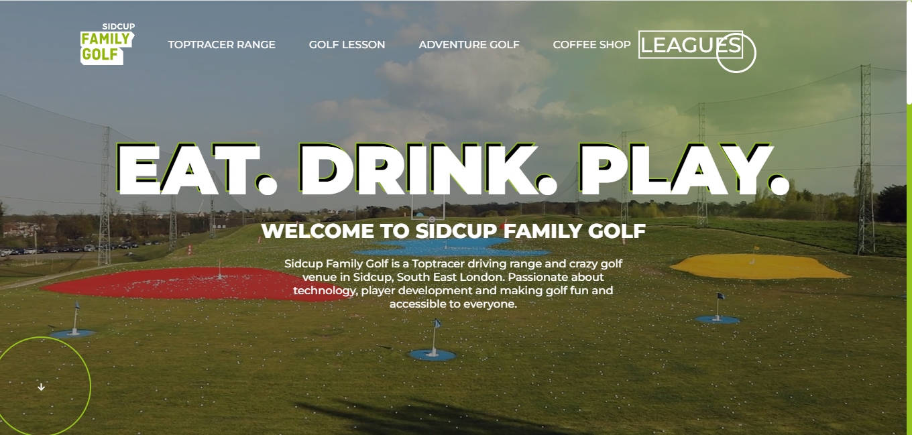
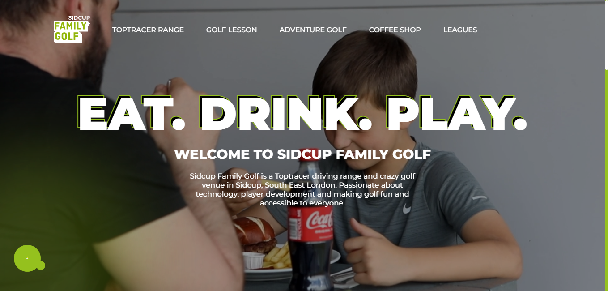
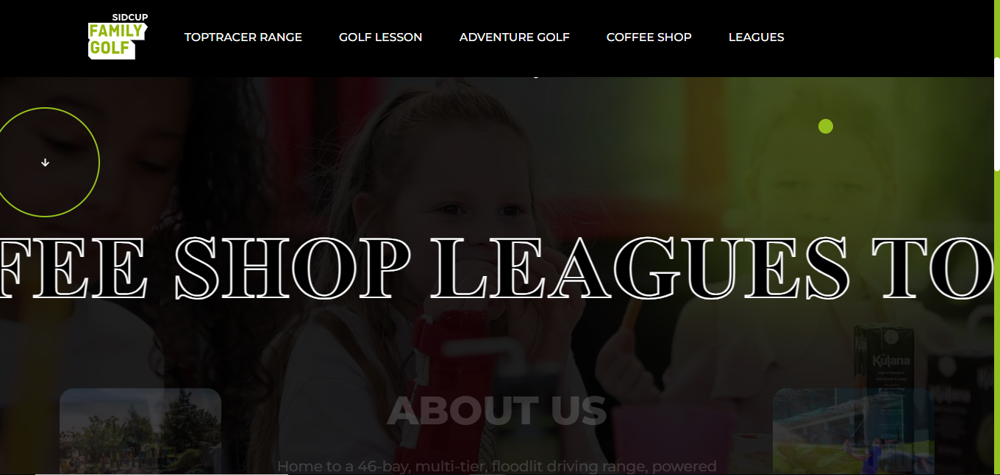
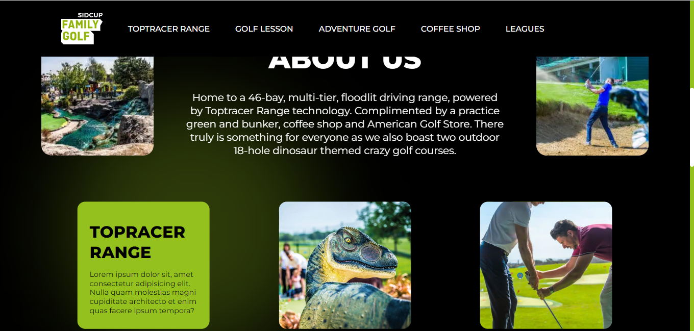
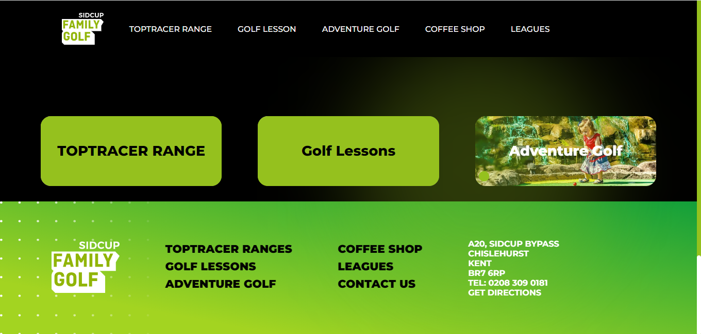

# Sidcup Family Golf Landing Page Clone

## Description

This project is a clone of the homepage (landing page) of the Sidcup Family Golf website. It is a simple HTML, CSS, and JavaScript project created for practice and learning purposes.

## Table of Contents

- [Installation](#installation)
- [Usage](#usage)
- [Screenshots](#screenshots)
- [Credits](#credits)

## Installation

There's no need for installation. You can simply open the `index.html` file in your web browser to view the cloned landing page.

## Usage

- Open the `index.html` file in your web browser to view the cloned landing page.
- Explore the project's structure to learn HTML, CSS, and JavaScript techniques.
- Customize the code and design as needed for your own projects.

## Screenshots

![Screenshot 1]
![Screenshot 2]
![Screenshot 3]
![Screenshot 4]
![Screenshot 5]

## Credits

- Original website: [Sidcup Family Golf](https://sidcupfamilygolf.com/)
- Icons: [Remix Icon](https://remixicon.com/)

#Author- Mohd Anas